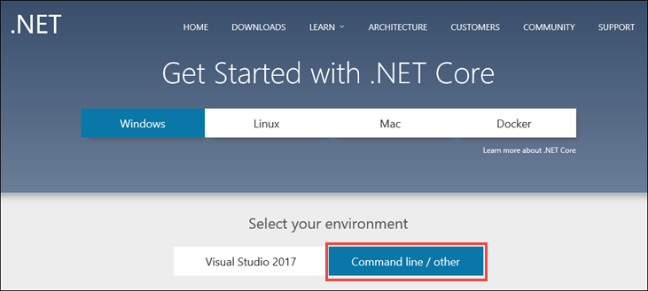

# Getting Started with ASP.NET Core

1. Install [.NET Core](https://microsoft.com/net/core).

   If you're on Windows, select the **Command line / other** environment. 

   

2. Create a new .NET Core project.

   On macOS and Linux, open a terminal window. On Windows, open a command prompt.

   ```terminal
   mkdir aspnetcoreapp
   cd aspnetcoreapp
   dotnet new web
   ```
    
   Note: Earlier versions of .NET Core required a `t` parameter, that is, `dotnet new -t web`. If you get an error running `dotnet new web`, install the latest [.NET Core](https://microsoft.com/net/core).  `dotnet --info` displays the .NET Core version. You should have version 2.0.0 or later.

4. Run the app.

   The `dotnet run` command builds the app first if needed.

   ```terminal
   dotnet run
   ```

5. Browse to `http://localhost:5000`

## Next steps

For getting-started tutorials, see [ASP.NET Core Tutorials](tutorials/index.md)

For an introduction to ASP.NET Core concepts and architecture, see [ASP.NET Core Introduction](index.md) and [ASP.NET Core Fundamentals](fundamentals/index.md).

An ASP.NET Core app can use the .NET Core or .NET Framework Base Class Library and runtime. For more information, see [Choosing between .NET Core and .NET Framework](https://docs.microsoft.com/dotnet/articles/standard/choosing-core-framework-server).
